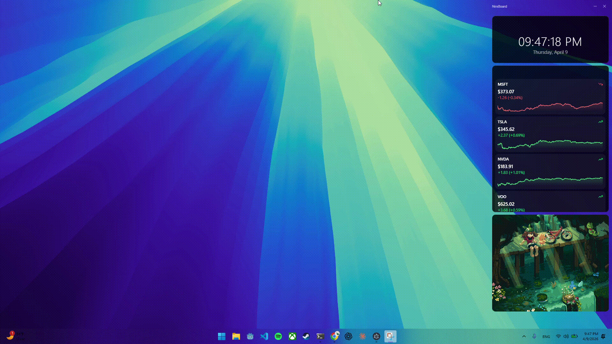

<div align="center">

# NexBoard

**A customizable desktop dashboard that lives behind all your windows**

[](https://github.com/zitaoyu/nexboard/releases)
[](LICENSE)
[](#)
[](https://electronjs.org)
[](https://react.dev)
[](https://www.typescriptlang.org)
[](#quality-gates)

</div>

---

<div align="center">
  
  <p><em>NexBoard running as a persistent desktop dashboard</em></p>
</div>

---

## Features

<table>
  <tr>
    <td width="50%">
      <h3>🖥️ Always-on-Bottom Window</h3>
      The dashboard sits behind all other windows — always visible, never in the way.
    </td>
    <td width="50%">
      <h3>🧩 Drag-and-Drop Widget Grid</h3>
      Arrange, resize, and reposition widgets freely on an infinite grid powered by react-grid-layout.
    </td>
  </tr>
  <tr>
    <td width="50%">
      <h3>📦 Widget System</h3>
      Built-in Clock and Timer widgets. Extend with your own by dropping a folder into <code>widgets/</code>.
    </td>
    <td width="50%">
      <h3>🚀 Mini Programs</h3>
      Full-screen apps launched from a dock. Each program can also contribute widgets to the dashboard.
    </td>
  </tr>
  <tr>
    <td width="50%">
      <h3>📈 Stock Tracker</h3>
      Real-time stock prices via Yahoo Finance (no API key needed). Auto-refreshes during market hours.
    </td>
    <td width="50%">
      <h3>✅ Todo List</h3>
      Persistent todo manager with a summary widget on the dashboard for quick at-a-glance status.
    </td>
  </tr>
  <tr>
    <td width="50%">
      <h3>🎨 Appearance Settings</h3>
      Adjust widget and background opacity, and scale the entire UI to fit your screen density.
    </td>
    <td width="50%">
      <h3>🔒 Quality Gates</h3>
      108 unit tests gate every release build — typecheck → lint → test → installer.
    </td>
  </tr>
</table>

---

## Getting Started

**Prerequisites:** [Node.js](https://nodejs.org/) >= 22, npm >= 10

```bash
# Install dependencies
npm install

# Start in development mode (with hot reload)
npm run dev
```

The app opens as a floating window in the top-right corner of your screen.

---

## Scripts

| Command | Description |
|---------|-------------|
| `npm run dev` | Start dev server with hot reload |
| `npm run dev:clean` | Start with wiped userData (fresh layout and settings) |
| `npm run build` | Compile source only (outputs to `out/`) |
| `npm run package` | Full release: typecheck → lint → test → installer in `dist/` |
| `npm run preview` | Preview the production build |
| `npm run typecheck` | TypeScript type checking (main + renderer) |
| `npm run lint` | ESLint — report only |
| `npm run lint:fix` | ESLint — auto-fix |
| `npm run test` | Run unit tests once (108 tests, Vitest) |
| `npm run test:watch` | Run tests in watch mode |

---

## Architecture

NexBoard uses the standard Electron three-process model (main / preload / renderer). Two parallel extension systems let you add functionality without touching core code:

### Widget System

Widgets are self-contained UI components that live on the dashboard grid. Each widget exports a `WidgetDefinition`:

```typescript
interface WidgetDefinition {
  manifest: WidgetManifest    // id, name, description, default/min/max size
  Component: ComponentType<WidgetProps>          // The widget UI
  SettingsComponent?: ComponentType<WidgetProps>  // Optional settings panel
}
```

To add a new widget: create a folder under `src/renderer/src/widgets/your-widget/` and register it in `widgets/registry.ts`.

### Mini Program System

Mini programs are full-screen apps accessible from the launcher. They can also provide widgets for the dashboard. Each exports a `MiniProgramDefinition`:

```typescript
interface MiniProgramDefinition {
  manifest: MiniProgramManifest  // id, name, icon, color
  AppComponent: ComponentType     // Full app UI
  widgets: WidgetDefinition[]     // Widgets this program provides
}
```

To add a new mini program: create a folder under `src/renderer/src/mini-programs/your-program/` and register it in `mini-programs/registry.ts`. Its widgets are automatically namespaced and forwarded to the global widget registry (e.g. `stock-tracker:ticker`).

### Always-on-Bottom

Desktop mode integration is handled in `src/main/desktop-mode.ts` using `electron-as-wallpaper` on Windows and `setAlwaysOnTop` with a level of `-1` on macOS.

---

## Tech Stack

| Layer | Technology |
|-------|-----------|
| Desktop shell | [](https://electronjs.org) + electron-vite |
| UI | [](https://react.dev) [](https://tailwindcss.com) |
| Language | [](https://www.typescriptlang.org) |
| State | [](https://zustand-demo.pmnd.rs/) (with persist middleware) |
| Data fetching | [](https://tanstack.com/query) |
| Dashboard grid | react-grid-layout |
| Charts | Recharts |
| Icons | lucide-react |

---

<details>
<summary>📁 Project Structure</summary>

```
src/
├── main/                          # Electron main process
│   ├── index.ts                   # Window creation, tray, app lifecycle
│   ├── desktop-mode.ts            # "Always on bottom" window behavior
│   └── ipc-handlers.ts            # IPC message handlers
│
├── preload/                       # Electron preload (context bridge)
│   ├── index.ts                   # Exposes window.electron and window.api
│   └── index.d.ts                 # Type declarations for the exposed APIs
│
└── renderer/                      # React app (renderer process)
    └── src/
        ├── main.tsx               # React entry point
        ├── App.tsx                # Root component
        ├── global.css             # Tailwind imports and global styles
        │
        ├── types/                 # TypeScript interfaces
        │   ├── widget.ts          # WidgetManifest, WidgetInstance, WidgetProps, WidgetDefinition
        │   ├── mini-program.ts    # MiniProgramManifest, MiniProgramDefinition
        │   └── layout.ts         # react-grid-layout types
        │
        ├── stores/                # Zustand state stores (persisted to localStorage)
        │   ├── dashboard-store.ts # Widget instances and grid layout
        │   ├── mini-program-store.ts # Active mini program navigation
        │   └── settings-store.ts  # User settings (opacity, scale)
        │
        ├── components/
        │   ├── layout/
        │   │   ├── AppShell.tsx          # Top-level shell: title bar + content area
        │   │   ├── DashboardGrid.tsx     # react-grid-layout powered widget grid
        │   │   ├── WidgetContainer.tsx   # Widget card wrapper with controls
        │   │   ├── AddWidgetButton.tsx   # FAB + modal to add widgets
        │   │   └── MiniProgramLauncher.tsx # iOS-style mini program picker
        │   └── settings/
        │       └── SettingsPanel.tsx     # Settings modal
        │
        ├── widgets/               # Built-in widgets
        │   ├── registry.ts        # Global widget registry
        │   ├── clock/             # Clock widget (time display)
        │   └── timer/             # Timer widget (countdown/stopwatch)
        │
        └── mini-programs/         # Built-in mini programs
            ├── registry.ts        # Global mini program registry
            ├── stock-tracker/     # Stock price tracker (Yahoo Finance)
            │   ├── api/           # API client
            │   ├── hooks/         # React Query hooks
            │   ├── components/    # UI components
            │   └── widgets/       # Dashboard widgets provided by this program
            └── todo/              # Todo list manager
                ├── store.ts       # Zustand store (persisted)
                ├── components/    # AddTodoForm, TodoItem
                ├── widgets/       # Todo Summary dashboard widget
                ├── manifest.ts    # MiniProgramDefinition export
                └── __tests__/     # Unit tests
```

</details>

---

## Quality Gates

Every `npm run package` run automatically executes:

```
typecheck  →  lint  →  test (108 unit tests)  →  build  →  installer
```

The installer in `dist/` is only produced when all checks pass. Run `npm run test` independently at any time to check the test suite.

---

<div align="center">

[](LICENSE)

</div>
